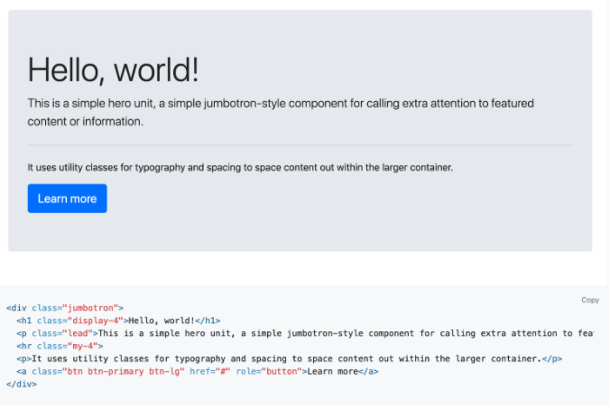
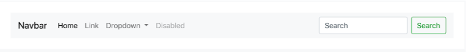
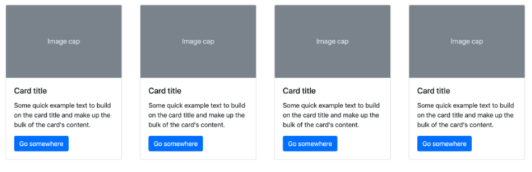

# Get Started With Bootstrap

Bootstrap 4 is a popular framework for rapidly prototyping designs.It’s easy to start.

Place the following link, in the `<head>` section of the HTML file: 
`<link rel="stylesheet" href="https://stackpath.bootstrapcdn.com/bootstrap/4.3.1/css/bootstrap.min.css" integrity="sha384-ggOyR0iXCbMQv3Xipma34MD+dH/1fQ784/j6cY/iJTQUOhcWr7x9JvoRxT2MZw1T" crossorigin="anonymous">`

- `Container`: Containers provide a means to center and horizontally pad your site’s contents.

- `Container-fluid`: Fluid containers function almost the same way as regular containers, except that they span the entire width of your device’s viewport.

- `Row`: Rows are wrappers for columns.

- `Column`: Columns are nested within rows and determine the width of your content within a row (Bootstrap rows can be divided into 12 columns). 

## Instructions

1. Copy the link above. You can also find the link and other ways to implement [Bootstrap here](getbootstrap.com).

2. Bookmark this useful link for future projects.

3. Open `index.html`. 

4. Paste the Bootstrap link into the `<head>` section of the HTML file.

-Now we’re free to use Bootstrap and its components on our page and we need to insert the link once for each website.

5. Open [this link](https://getbootstrap.com/docs/4.3/components/alerts/) to the Bootstrap component documentation.

6. Navigate to the `jumbotron` component. Then copy the code listed on the page.

7. Paste the code in the `<body>` of `index.html`. Save your page and refresh to see the changes.

  

8.  Navigate to the [Bootstrap component documentation](https://getbootstrap.com/docs/4.3/components/navbar/) and then to the `navbar` component.

9. Copy the code for the first `navbar` on the page. Then paste it above the `jumbotron` component.

10. Be sure to place the code within the `<body>` of `index.html`.

11. Save your page to see the changes. You should see something resembling the following: 

  

<!-- Containers and Rows -->
12. Add a `
` with the class `container-fluid` after your `jumbotron`.

13. Within this new `
`, add another `
` with the class `row`.

14. At this point, you should have two `
` tags, one nested in the other. 

15. Lastly, add a `
` with the classes `cardContainer col-lg-3 col-md-3 col-sm-12` within the row div.

16. Final step is to copy and paste this newly created `
` three times within the `row div`. 

17. You should now have a `row 
` with four children `
` tags. 

18. If you want to see what is happening on the page, add some dummy copy within the child divs.
<!-- cards -->

19. Review the [Boostrap documentation](https://getbootstrap.com/docs/4.3/components/card/) on cards.

20. Copy the code for the first card component on the page. Paste the code inside each `
` with a class of `cardContainer col-lg-3 col-md-3 col-sm-12`.

21.  Save the changes and refresh the page, then, the results should look like the image shown below: 

  

22. Add the corresponding images to the cards from the images(src="images/1_card.png" ....).

23. Save the changes and refresh the page to see the results.

<!-- Add a Form to Your Page  -->
24. In `index.html` file, create a section with the class of `container-fluid` and `signUp`.
- Nested inside of it, create a div with the class of row. We will nest our form inside this element.

25. Open the Bootstrap form component page: https://getbootstrap.com and navigate to the first form element you find on the page, then,copy it and paste it into your HTML below your cards; comment `<!-- Add form group below →`.

26. Open the `index.css` file and add the following properties to the class `signUp`.
      - Give this CSS selector the property `margin` with a property of `35px auto` to center our form element and give it some spacing.
      - Give this CSS selector the `background-color` property with a value of `#f2f2f2`.
      - Give this CSS selector the property of `padding` with a value of `25px`.
      - Give this CSS selector a `border-radius` of `7px`.

<!-- Add a Modal to Your Page -->
27.  Open Bootstrap’s modal component page: https://getbootstrap.com/docs/4.3/components/modal/#live-demo.

28. Copy the modal element of the live demo and paste it into your HTML.

29. Delete the button element, so you can link the modal to your own button pictured below.
    This button has two important attributes to take note of:
    - `data-toggle=”modal”`
    - `data-target=”#exampleModal”`
    Add these two attributes to the button in the `jumbotron`.

30. Reload your page and see the result. Make sure you click the `jumbotron` button! You should see your modal animate before your eyes.The       
    attribute data target must match the ID of the jumbotron you want it to toggle. You can have multiple modal windows, but each must have a 
    different ID and data target.