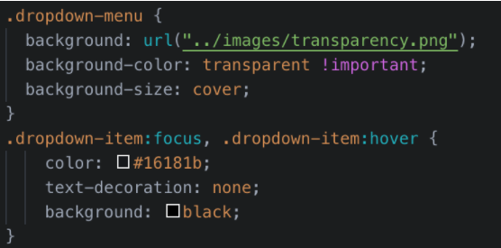
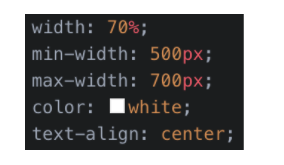

# Custom Webpage Navbar and Jumbotron

Every website needs an intuitive and well-crafted navigation layout so that users can quickly get to the content they’re seeking. Bootstrap’s default navigation component offers a pretty good solution.In this activity, we’ll customize our site’s navbar to better reflect the site’s layout and overall brand identity.

  

   

## Instructions

<!-- Custom Navbar -->
1. Open the `index.html`. 

2. Add the `customNav` class to the `<nav>` element.
- We will use this new class to style your navbar later.

3. Update the first `<a>` tag by replacing the Navbar text with the following:
- An ` tag`.
- Add the text `Rock Nation`.

4. Make the following text changes to the list items in the navbar:
- Change `Home` to `Venues`, `Link` to `Artist`, and `Dropdown` to `Near You`.

5. Change the three `dropdown` options to `Venues`, `Artists`, and `Upcoming Acts`.

6. Next, delete the `<form>` element from the template navbar.

7. Add a new navigation list item with a button inside:
- Add a `<li>` tag after the dropdown `<li>`.
- Give it the same class name as the other `<li>` elements in the navbar.
- Add a `<a>` tag with the following properties:
  - `btn btn-primary btn-lg navCTA classes`
  - `href="#"`
  - `role="button"`
  - `Buy Tickets` text

8. Open `index.css`.Create a selector that targets all the heading tags (`<h1>` through `<h6>`).

9. Add the property `font-family` and set its value to `'Anton', sans-serif;` or your choice.

10. Add a selector that targets the `
` element and sets its `font-family` to `'Jura', sans-serif;` or select your choice.

5. Add the following selectors, properties, and values to begin styling your navbar:

> Note the use of `!important` to force some CSS rules to apply.

- [What does `!important` mean?](https://www.lifewire.com/what-does-important-mean-in-css-3466876)

  

6. Setting the `z-index value` for the `customNav` class ensures that the navbar is above other content on the page.

7. Next, customize the drop-down menu with the following CSS:
	
  

- The `:focus` and `:hover` pseudo-classes allow us to apply particular styling when a user interacts with an element.

8. Lastly, customize the button and links in the navigation with the following:

  

Now you have a fully customized navbar for your site!

<!-- Custom Jumbotron -->
9.  Add the `rockBackground` class to the `jumbotron 
`.

10. Add a new `
` with the class `jumboCopy` within the `jumbotron 
`.

11. Move the jumbotron’s content within this new `
`.

12. Update the copy and button text in the jumbotron to reflect the design above. 

13.  Add the following CSS within a selector that targets the `jumbotron 
`:

  

  You can change cover to contain and no-repeat to repeat, for a different appearence😉.

14. Add a selector for the `jumboCopy` class with the following properties and values:

  

15. Refresh the webpage and see the Result!😎
