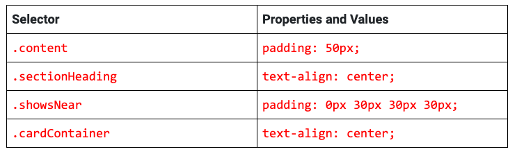
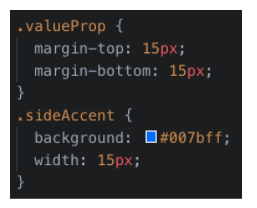
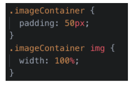
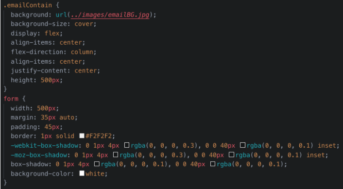

# Custom Webpage

In this activity, we will customize the default Bootstrap 4 cards, content, and footer components to better reflect the site’s content.

## Instructions

### Custom Cards

1. Find the `container-fluid 
` and add the class `content`.

2. Within the `container-fluid 
`, but before the `row 
`, add an `<h2>` tag.
- Add the class `sectionHeading`.
- Add the text `Shows Near You`.

3. Next, add the `showsNear` class to the `row 
`.

4. Update the column sizing for each `cardContainer 
` to `col-lg-4 col-md-4 col-sm-12`.

5. Update each `` tag to use pictures in the images folder.

6. Update the copy for each card and button to match the design, or get creative and add your own.

7. Add the following selectors and properties to style the cards section:
  
  

Now the cards should be fully responsive with custom imagery.

  

### Custom Webpage Content Section

To add to and style the content section of the website follow the below instructions.

#### Part 1: Update the HTML

1. Add the content class to the `container-fluid 
`.

2. Next, add a title to this `
` by adding an `<h2>` tag with the text `Why we're better`.

3. Give the `<h2>` tag the `sectionHeading` class.

4. Add the `valueProp` class to the `row 
`.

5. Within the `row 
`, add the `imageContainer` class to the `
` that contains an image.

> Note that the design has two more rows in this section. Duplicate the first row twice. Update the images and copy for each duplicated row.

#### Part 2: Update the CSS

1. Add the following CSS to style the `valueProp` and `sideAccent` classes:

  

2. Next, add the following to style the `imageContainer` class and images inside that element:

  

3. Now have three rows of content on our template.

  

### Custom Webpage Footer

Let's customize our site’s footer with a call to action (CTA).

  

#### Part 1: Update the HTML

1. Add the `emailContain` class to the `<footer>` tag.

2. Next, add an `<h3>` tag within the `<form>` tag but above the `form-group 
`.

3. Type `Join Our Mailing List` within the `<h3>` tag.

#### Part 2: Update the CSS

1. Add the following selectors, properties, and values to the footer and the form contained within:.

  

- Completed our Bootstrap template.💃💃