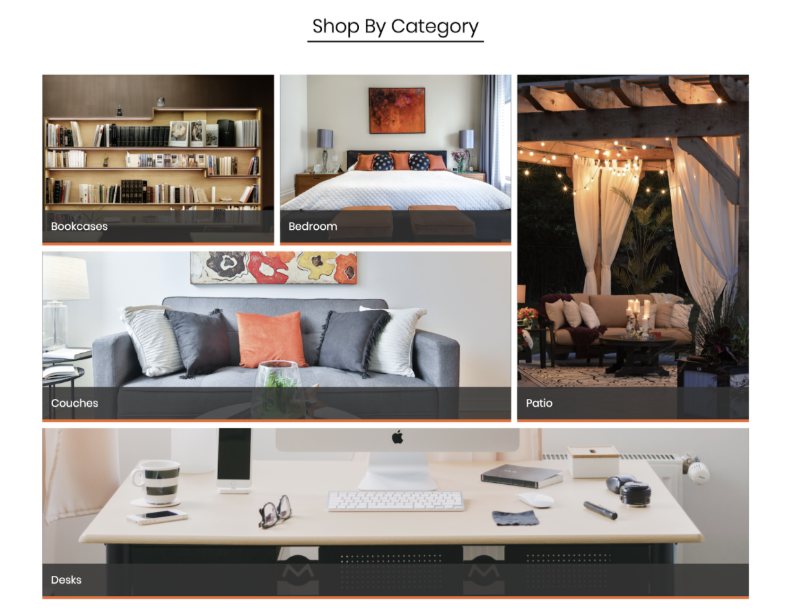

# CSS Grid Part 2

CSS Grid can be used to build simple and skeletal layouts. It can also be used to create polished, professional-level layouts.
Here, we are going to design an online furniture store.

## Instructions

### Part 2: Furniture Grid 

In this section, we will finish building the rest of the page fron CSS GRID PART1. The Final solution is available at,

  

* Add a `div` with the class `subHeading`and create an `h3` tag and add the text “Shop by Category” within this `div`.

* Create the second grid and give the ID `categoryGrid` inside a section tag, and add the following properties,
            margin: 0px 5%;
            display: grid;
            grid-template-rows: 300px 300px 300px;
            grid-template-columns: 1fr 1fr 1fr;
            grid-template-areas:
            "bookcases bedroom patio"
            "couches couches patio"
            "desks desks desks";

* For the `subHeading` class, add the following properties:
              text-align: center;
              border-bottom: 2px solid black;
              width: 300px;
              margin: 50px auto;

* For categoryGrid, add `margin: 0px 5%;` and `display: grid;` and use the `grid-template-rows`, `grid-template-columns`, and `grid-template-areas` properties to create the structure of the grid. Row 300px tall and column should occupy one-third of the area (use fractional units).

* Next, create `five selectors` that target each grid area you created in `index.html` and add background images.

* For categoryGridArea add the properties,
          background-position: center;
          background-size: cover;
          background-repeat: no-repeat;
          margin: 5px;
          cursor: pointer;
          display: grid;
          align-content: end; 

* Lastly, create a selector to target the `heading` class with the following properties:
          background-color: rgba(0,0,0,0.7);
          padding: 15px;
          height: 25px;
          color: white;
          font-size: 18px;
          border-bottom: 5px solid #FF6200;
	
Find the result in Web browser ✨